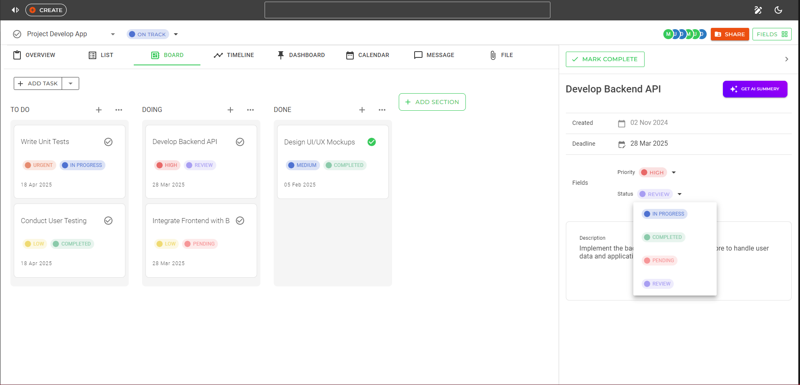
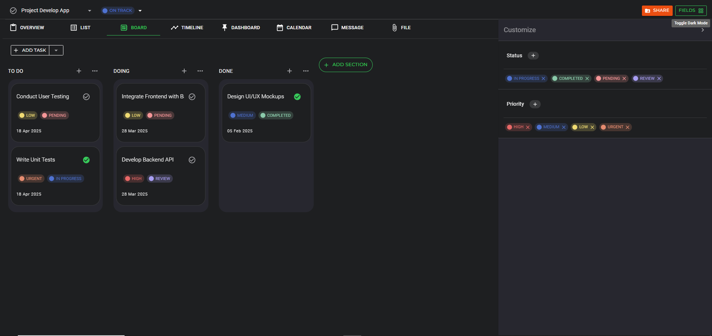
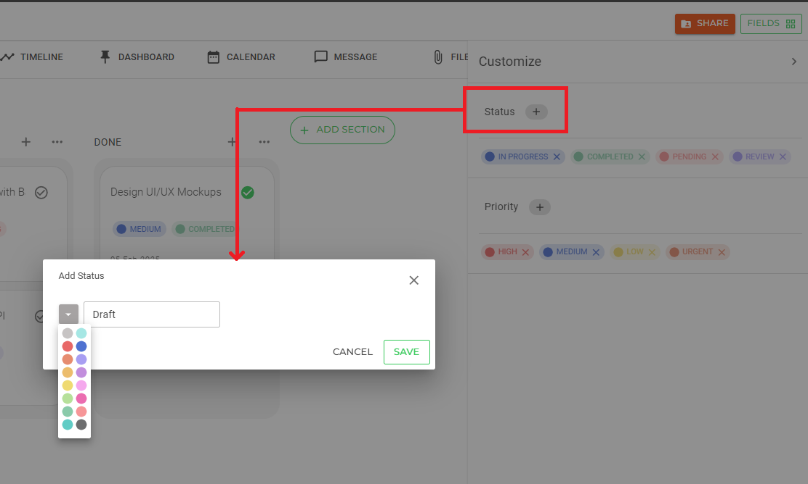
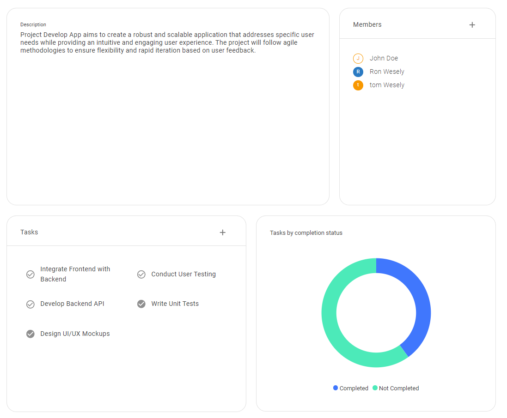
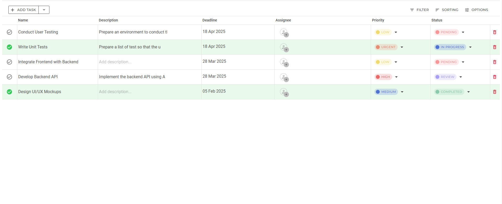
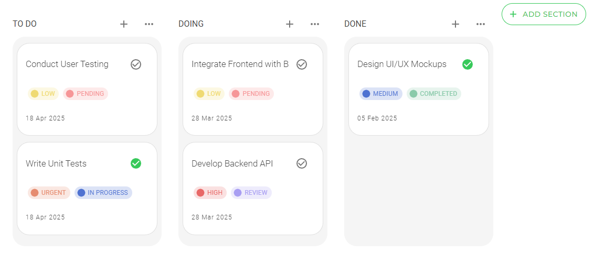
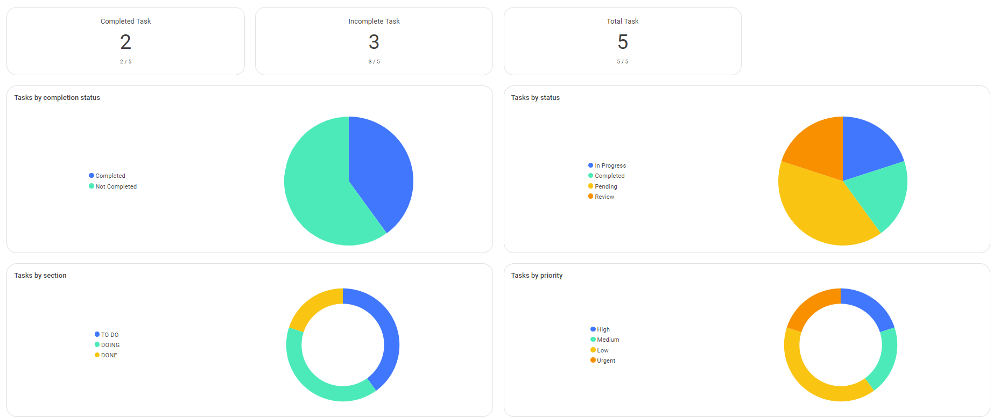
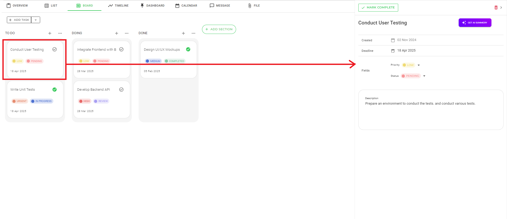
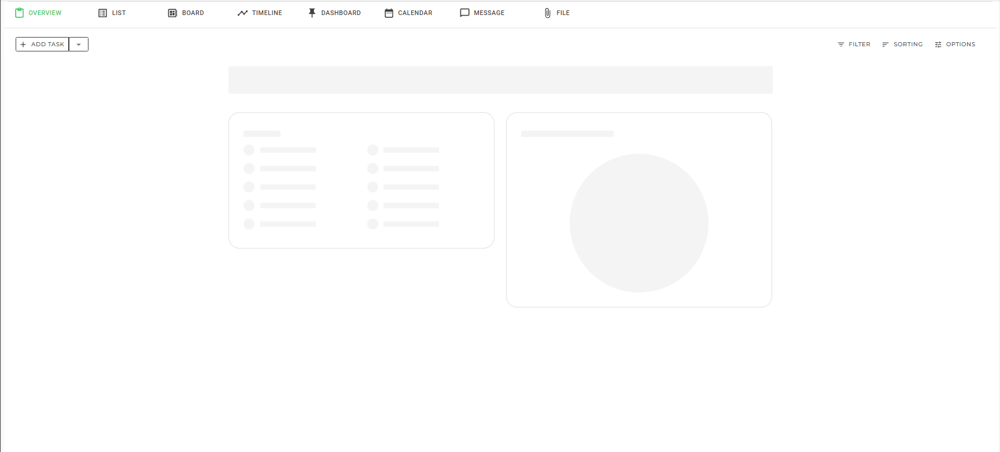
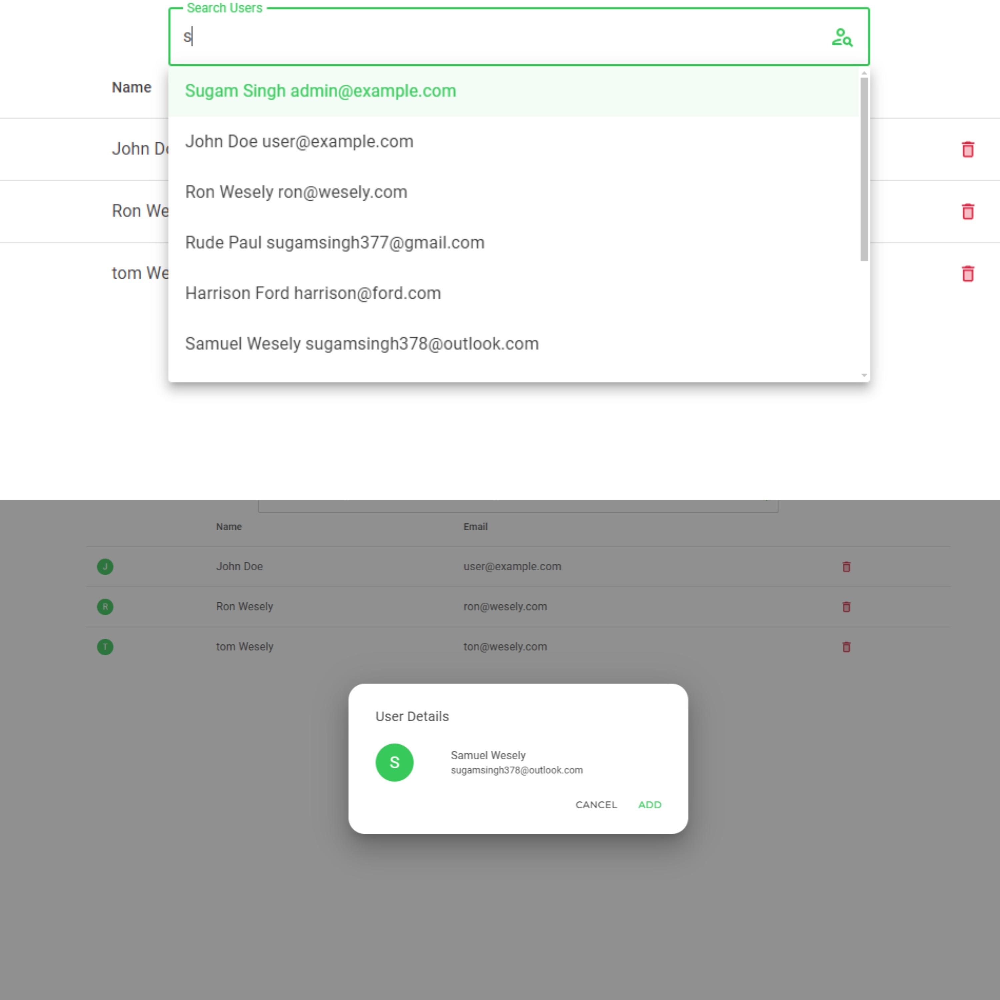

*Board View: Kanban-style workflow visualization with intuitive drag-and-drop*
# ProMgt - Project Management Application
 
ProMgt is a powerful project management web application built with ASP.NET Core 8 Blazor and MudBlazor, inspired by Asana. It offers a comprehensive suite of features for efficient project and task management.

## 🌟 Key Features

## 🚀 Technical Stack
- ASP.NET Core 8
- Blazor Framework
- MudBlazor Component Library
  
### Project Management
- Create and manage multiple projects
- Update project properties dynamically
- Flexible project status management
- Dark/Light mode theme support

*Dark Mode of Web App: Showcases the sleek and modern dark theme interface.*

### Task Management
- Create, update, and delete tasks within projects
- Organize tasks into customizable sections
- Default sections: To-do, Doing, Done
- Add/remove sections with automatic task redistribution

### Custom Fields
- Project-specific custom fields
- Customizable Priority levels
- Flexible Task Status definitions
- Easy field management through right-side drawer

*Adding a New Field: Demonstrates the user interaction for adding a new field, triggered by a button click and a pop-up.*

### Multiple Views
1. **Overview**
   - Comprehensive project and task information
   - Quick project status assessment  

*Task View Style - Overview: Provides an overall view of the task management interface.*

2. **List View**
   - Detailed task listing
   - Inline task editing capabilities

*Task View Style - Listview: Displays tasks in a structured list format for better organization.*

3. **Board View**
   - Kanban-style task organization
   - Drag-and-drop functionality between sections

*Task View Style - Board View: Visualizes tasks in a board format, ideal for workflow management.*

4. **Dashboard View**
   - Visual project analytics
   - Pie and donut chart representations
   - Task summary statistics

*Task View Style - Dashboard View: Highlights the dashboard, offering a comprehensive view of tasks and analytics.*

### Task Details
- Right-side drawer for detailed task information
- Real-time updates across all views
- Comprehensive task editing capabilities

*Task Details Drawer: Opens a detailed view of a selected task, providing all relevant information in a side drawer.*

## 💡 Features Highlight
- Responsive design
- Real-time UI updates
- Intuitive drag-and-drop interface
- Customizable workflows
- Visual project analytics
- Enhanced loading states using MudSkeleton
  - Smooth loading experience
  - Visual feedback during data fetching
  - Placeholder content while loading

*Loading Skeleton: Placeholder skeleton screen while the page content is loading, ensuring a smooth user experience.*

## 🎯 Target Users
- Project managers
- Development teams
- Organizations seeking efficient project management
- Individual users managing personal projects

*User Search and Contact Addition: The top image showcases a search bar with a dropdown suggestion for finding registered users. The bottom image displays the contact card of a user with an option to add them.*

## 🔄 Live Updates
- Real-time UI synchronization
- Immediate reflection of changes across views
- Seamless user experience

### 👥 Team Management
- Search and add users to your team
- Assign team members to projects
- Task assignment to team members
- Team members can mark task completion

## 🎨 UI/UX Features
- Clean and modern interface
- Dark/Light mode toggle
- Responsive drawer components
- Intuitive navigation
- Skeleton loading states for better UX
